# CAPTURAS DEL SISTEMA
## Sistema de Gestión Académica Completa

---

Este documento presenta las capturas de pantalla del sistema funcionando, mostrando todas las funcionalidades implementadas.

---

## 1. DIAGRAMA ENTIDAD-RELACIÓN

### Figura 1: Modelo de Base de Datos Completo

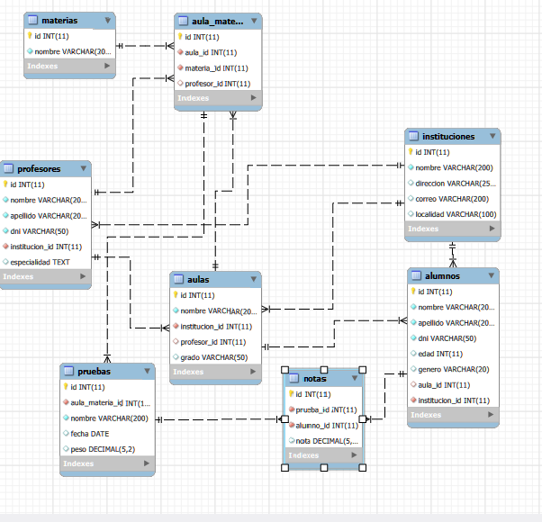

**Descripción:** Diagrama Entidad-Relación de la base de datos `db_alumnoss` generado con MySQL Workbench. Se observan las 8 tablas principales (instituciones, profesores, aulas, materias, aula_materia, alumnos, pruebas, notas) con sus relaciones y claves foráneas. El modelo está normalizado hasta 3FN.

**Elementos clave:**
- Relaciones 1:N entre instituciones-aulas, aulas-alumnos
- Tabla intermedia aula_materia para relación N:M
- Integridad referencial con CASCADE y SET NULL

---

## 2. INTERFAZ PRINCIPAL

### Figura 2: Dashboard Principal del Sistema

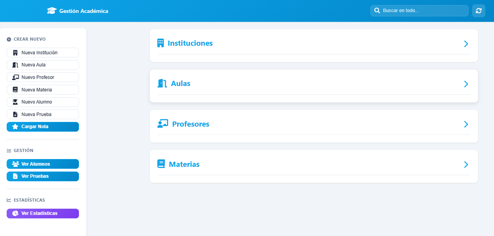

**Descripción:** Pantalla principal del sistema mostrando el sidebar de navegación, topbar con título y botones de acceso rápido para crear nuevas entidades. Desde aquí se accede a todos los módulos del sistema.

**Elementos visibles:**
- Sidebar izquierdo con menú de navegación
- Topbar azul con gradiente
- Botones de acción: Nueva Institución, Nuevo Profesor, Nueva Aula, etc.
- Diseño responsive con colores institucionales

---

### Figura 3: Vista de Listas en Inicio

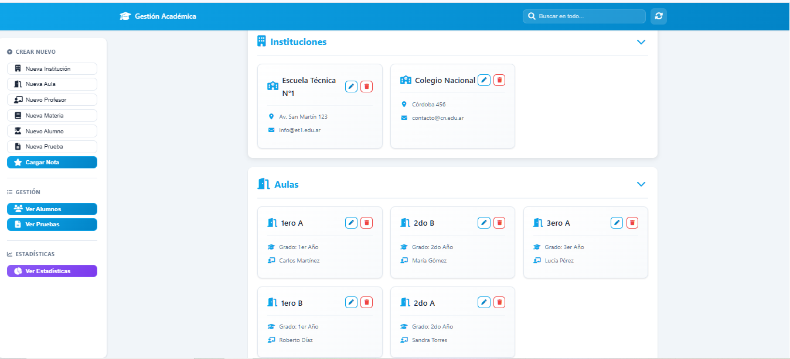

**Descripción:** Vista del dashboard mostrando las listas/tablas de datos disponibles en el sistema. Interface limpia y organizada para acceso rápido a la información.

---

## 3. MÓDULO DE ALUMNOS

### Figura 4: Listado Completo de Alumnos

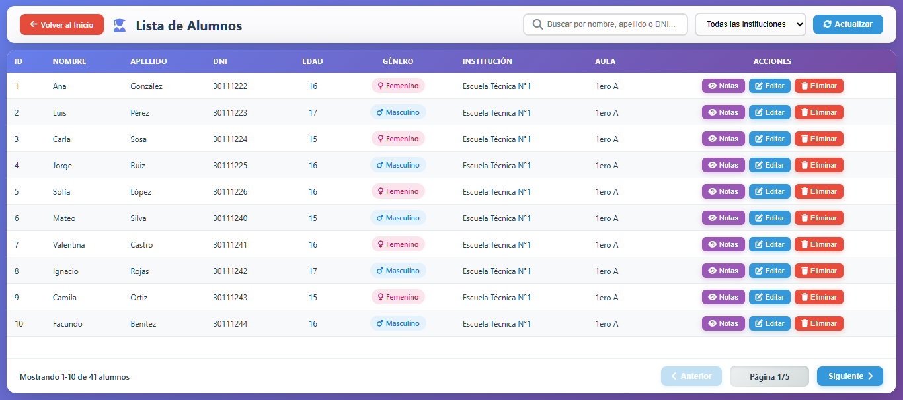

**Descripción:** Tabla completa de alumnos registrados en el sistema, mostrando datos personales y académicos.

**Columnas visibles:**
- ID del alumno
- Nombre completo (nombre y apellido)
- DNI
- Edad
- Género
- Aula asignada
- Institución de pertenencia
- Acciones (Ver notas, Editar, Eliminar)

**Funcionalidades:**
- Búsqueda y filtrado
- Ordenamiento por columnas
- Acciones CRUD completas

---

### Figura 5: Modal de Creación de Alumno

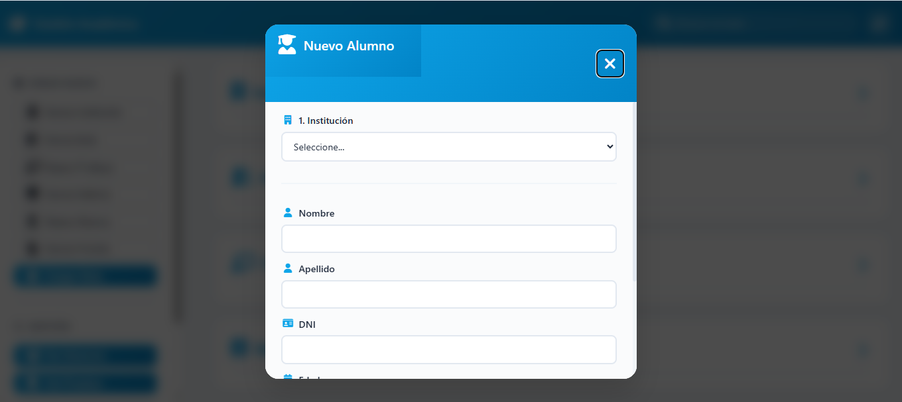

**Descripción:** Modal optimizado para crear un nuevo alumno. Formulario compacto sin necesidad de scroll, con todos los campos visibles.

**Campos del formulario:**
- Datos personales: Nombre, Apellido, DNI
- Edad y Género
- Selección de Institución (filtro dinámico)
- Selección de Aula (dependiente de institución)
- Botones de acción: Guardar / Cancelar

**Optimizaciones aplicadas:**
- Header compacto (0.9rem padding)
- Inputs reducidos (0.6rem padding)
- Labels pequeños (0.9rem)
- Sin scroll innecesario

---

### Figura 6: Modal de Visualización de Notas

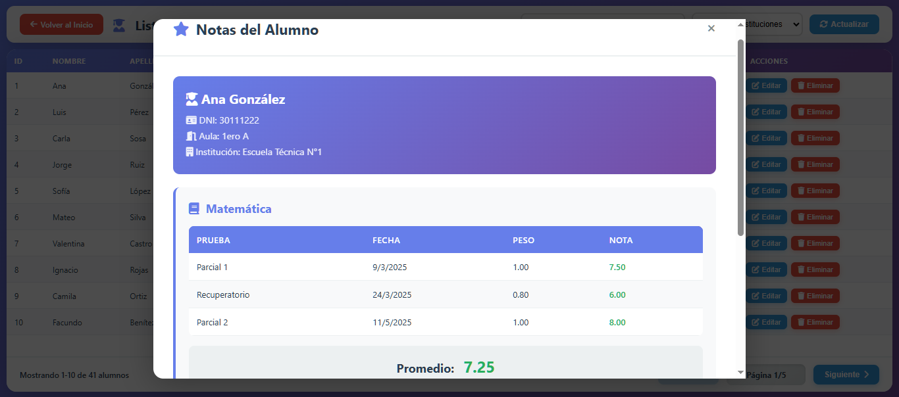

**Descripción:** Modal que muestra el historial completo de notas de un alumno seleccionado.

**Información mostrada:**
- Nombre del alumno en el título
- Tabla con: Materia, Prueba/Evaluación, Fecha, Calificación
- Promedio general del alumno
- Estado académico (Aprobado/Desaprobado)

**Análisis:** Permite hacer seguimiento del rendimiento individual de cada estudiante y detectar materias con dificultades.

---

## 4. MÓDULO DE PRUEBAS Y NOTAS

### Figura 7: Listado de Pruebas/Evaluaciones

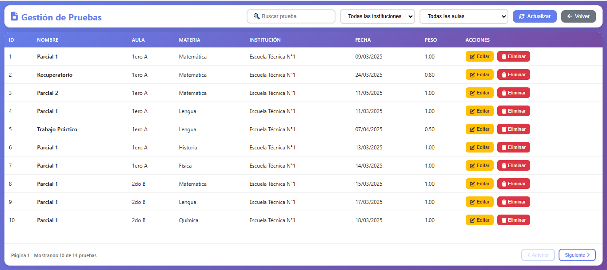

**Descripción:** Gestión completa de evaluaciones y exámenes del sistema.

**Columnas:**
- ID de la prueba
- Nombre/descripción de la evaluación
- Fecha de realización
- Aula a la que pertenece
- Materia correspondiente
- Acciones disponibles

**Funcionalidad:** Permite crear, editar y eliminar evaluaciones, además de asignar notas masivamente a los alumnos.

---

### Figura 8: Modal de Nueva Prueba

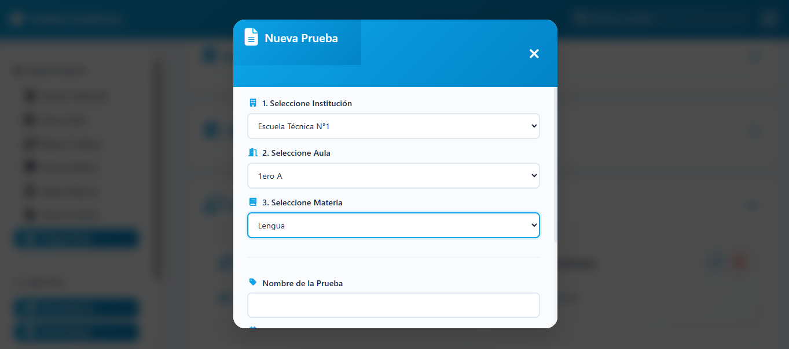

**Descripción:** Formulario para crear una nueva evaluación con todos los datos necesarios.

**Campos:**
- Nombre de la prueba
- Fecha
- Selección de Aula
- Selección de Materia
- Tipo de evaluación (opcional)

---

### Figura 9: Modal de Carga de Notas

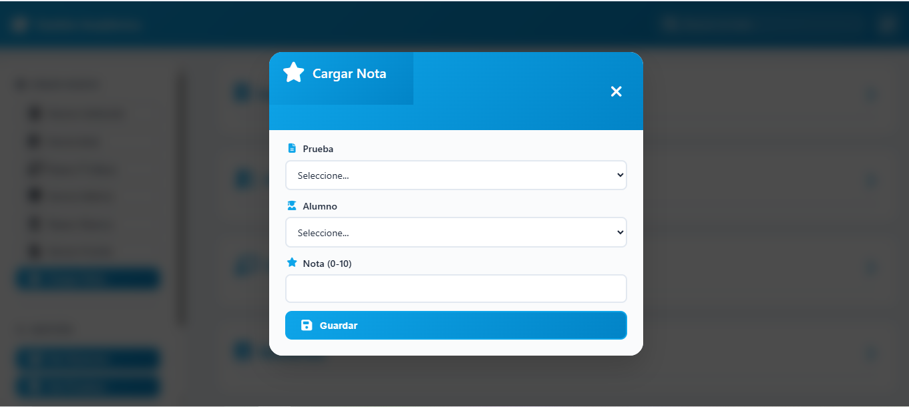

**Descripción:** Interface para cargar calificaciones de alumnos en una prueba específica.

**Características:**
- Selección de alumno y prueba
- Validación de nota (1-10)
- Confirmación antes de guardar
- Feedback visual del resultado

---

## 5. MÓDULOS DE GESTIÓN ADMINISTRATIVA

### Figura 10: Modal de Nueva Institución

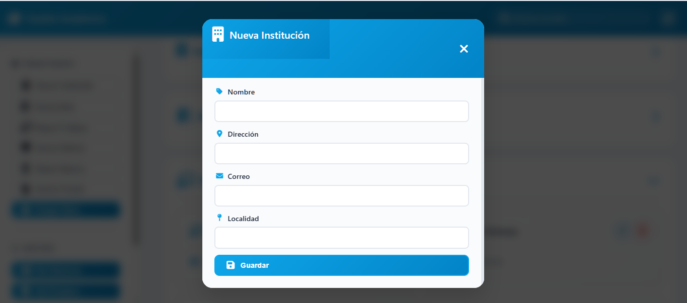

**Descripción:** Formulario para registrar nuevos establecimientos educativos.

**Campos:**
- Nombre de la institución
- Dirección completa
- Teléfono de contacto
- Email institucional

---

### Figura 11: Modal de Nuevo Profesor

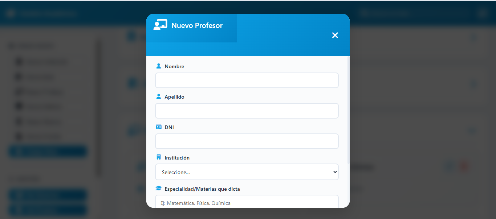

**Descripción:** Registro de docentes del sistema.

**Datos requeridos:**
- Nombre y apellido
- DNI único
- Email de contacto
- Teléfono
- Especialidad/área (opcional)

---

### Figura 12: Modal de Nueva Aula

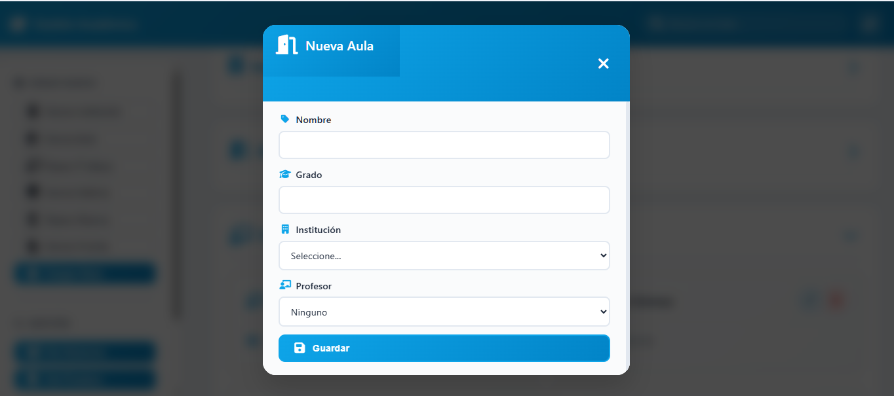

**Descripción:** Creación de cursos/divisiones con modal optimizado (sin scroll).

**Configuración:**
- Nombre del aula (ej: "1ero A", "2do B")
- Grado/año
- Institución a la que pertenece
- Profesor asignado (preceptor)
- Turno (Mañana/Tarde/Noche)

**Optimización:** Todos los campos visibles sin necesidad de desplazarse.

---

### Figura 13: Modal de Nueva Materia

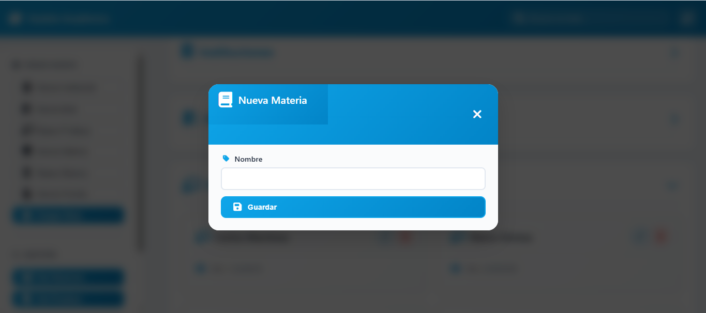

**Descripción:** Registro de asignaturas disponibles en el sistema.

**Campos:**
- Nombre de la materia
- Descripción breve
- Área de conocimiento

---

## 6. MÓDULO DE ESTADÍSTICAS Y ANÁLISIS

### Figura 14: Panel de Estadísticas - Vista Superior

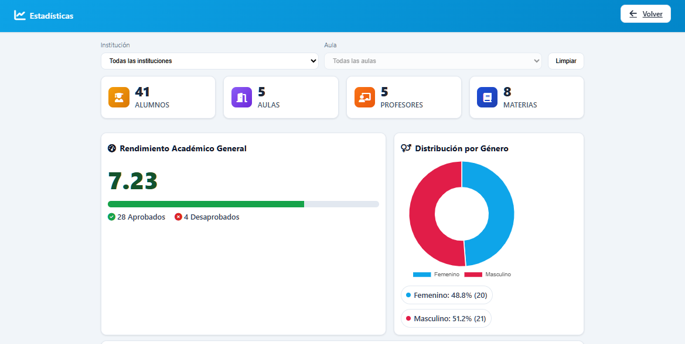

**Descripción:** Página completa de análisis estadístico con múltiples visualizaciones.

**Componentes visibles:**

**Filtros dinámicos:**
- Selector de Institución (actualiza todas las métricas)
- Selector de Aula (filtrado dependiente)
- Botón "Limpiar filtros"

**Tarjetas de métricas (4):**
1. **Total Alumnos** - Contador con ícono de graduado
2. **Total Aulas** - Contador con ícono de aula
3. **Total Profesores** - Contador con ícono de docente
4. **Total Materias** - Contador con ícono de libro

Cada tarjeta tiene:
- Gradiente de color único
- Ícono representativo (Font Awesome)
- Número grande y legible
- Etiqueta descriptiva

**Panel de Rendimiento Académico (izquierda):**
- Promedio general grande (ej: 7.23)
- Barra de progreso con gradiente azul/morado
- Indicador visual del nivel (72.3% de 10)
- Contadores:
  - ✓ Aprobados (nota ≥ 6)
  - ✗ Desaprobados (nota < 6)

**Gráfico de Distribución por Género (derecha):**
- Gráfico de dona interactivo (Chart.js)
- Colores: Rosa (#ec4899) para Femenino, Azul (#3b82f6) para Masculino
- Leyenda inferior con:
  - Porcentaje de cada género
  - Cantidad absoluta de alumnos
  - Indicadores de color

**Análisis:** Este panel permite identificar rápidamente la composición del alumnado y el rendimiento académico general del sistema o de una institución/aula específica.

---

### Figura 15: Panel de Estadísticas - Tablas Detalladas

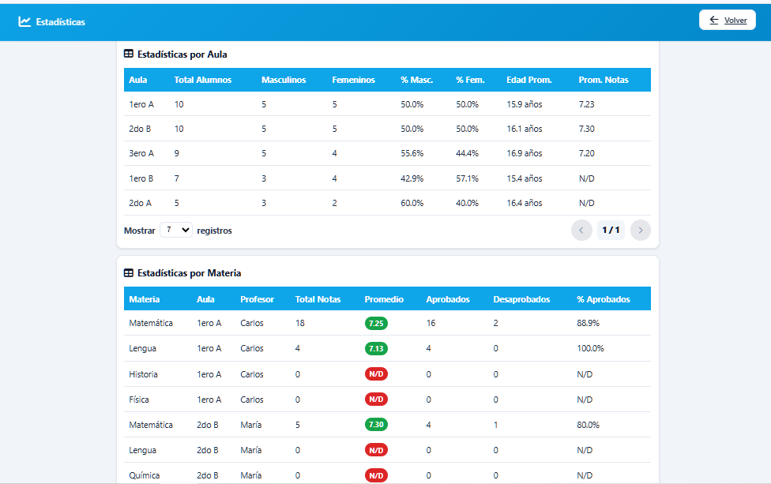

**Descripción:** Sección inferior del módulo de estadísticas con tablas analíticas y sistema de paginación.

**Tabla 1: Estadísticas por Aula**

Columnas:
- **Aula**: Nombre del curso (ej: "1ero A")
- **Total**: Cantidad de alumnos inscriptos
- **♂ / ♀**: Distribución de género (masculino / femenino)
- **Edad prom.**: Promedio de edad del aula (redondeado a 1 decimal)
- **Promedio**: Promedio de notas del aula (redondeado a 2 decimales)

**Tabla 2: Estadísticas por Materia**

Columnas:
- **Materia**: Nombre de la asignatura
- **Profesor**: Docente a cargo
- **Evaluaciones**: Cantidad de pruebas realizadas
- **Promedio**: Nota promedio de la materia
- **Aprobados**: Cantidad de alumnos con nota ≥ 6
- **Desaprobados**: Cantidad de alumnos con nota < 6

**Sistema de Paginación:**

Cada tabla incluye controles de paginación optimizados:

**Lado izquierdo:**
- Selector "Mostrar [7/10/20] registros"
- Permite ajustar la cantidad de filas visibles
- Valor por defecto: 7 registros

**Lado derecho:**
- Botón "◄ Anterior" (circular con gradiente azul)
  - Activo cuando no estás en la primera página
  - Deshabilitado (gris) en página 1
- Indicador "Página X de Y" (estilo pill con fondo gris claro)
- Botón "Siguiente ►" (circular con gradiente azul)
  - Activo cuando hay más páginas
  - Deshabilitado en la última página

**Diseño de botones:**
- Forma circular (40px × 40px)
- Gradiente azul (#3b82f6 → #8b5cf6)
- Efecto hover: scale(1.05) + sombra
- Estado disabled: gris (#d1d5db), cursor not-allowed

**Análisis de uso:**

1. **Por Aula:** Permite identificar cursos con bajo rendimiento, desbalance de género o promedios de edad fuera de rango.

2. **Por Materia:** Facilita detectar asignaturas con alta tasa de desaprobación que requieren refuerzo pedagógico.

3. **Paginación:** Mejora la UX al no sobrecargar la vista con muchos datos simultáneos.

**Funcionalidad de filtros:** Todas las tablas se actualizan dinámicamente cuando se aplican filtros de institución o aula, mostrando solo los datos relevantes.

---

## 7. INTERPRETACIÓN DE LOS GRÁFICOS

### 7.1. Gráfico de Dona - Distribución por Género

**Tipo de gráfico:** Doughnut Chart (Chart.js)

**Variables representadas:**
- Femenino (rosa): Porcentaje y cantidad de alumnas
- Masculino (azul): Porcentaje y cantidad de alumnos

**Interpretación:**
- Permite identificar rápidamente el balance de género en la población estudiantil
- Útil para políticas de inclusión y planificación de recursos
- Ejemplo: Si muestra 55.6% Femenino / 44.4% Masculino, indica una leve mayoría femenina

**Cálculo:** 
```
Porcentaje = (Cantidad del género / Total de alumnos) × 100
```

---

### 7.2. Barra de Progreso - Rendimiento Académico

**Tipo de visualización:** Progress Bar con gradiente

**Variable representada:** Promedio general de notas (escala 1-10)

**Interpretación de niveles:**
- **0-59%** (0-5.9 puntos): Rendimiento bajo - Requiere intervención urgente
- **60-74%** (6-7.4 puntos): Rendimiento medio - Aprobado pero mejorable
- **75-84%** (7.5-8.4 puntos): Rendimiento bueno - Por encima del promedio
- **85-100%** (8.5-10 puntos): Rendimiento excelente - Destacado

**Cálculo:**
```
Porcentaje = (Promedio de notas / 10) × 100
```

**Ejemplo:** Un promedio de 7.23 representa un 72.3%, indicando rendimiento medio-bueno.

---

### 7.3. Tablas de Datos - Análisis Multidimensional

**Propósito:** Permitir análisis detallado por segmentos (aulas y materias)

**Casos de uso:**

1. **Detección de aulas con bajo rendimiento:**
   - Buscar promedios < 6 en la tabla de Aulas
   - Acción: Refuerzo pedagógico o cambio de estrategia

2. **Identificación de materias problemáticas:**
   - Buscar alto porcentaje de desaprobados en tabla de Materias
   - Acción: Capacitación docente, material didáctico adicional

3. **Análisis demográfico:**
   - Columnas de género y edad promedio por aula
   - Útil para planificación de recursos y grupos

4. **Monitoreo de carga de trabajo:**
   - Cantidad de evaluaciones por materia
   - Evitar sobrecarga de exámenes

---

## 8. CONCLUSIÓN DE LAS CAPTURAS

Las capturas presentadas demuestran:

✅ **Sistema completo y funcional** con todos los módulos CRUD implementados

✅ **Interfaz de usuario optimizada** con modales compactos y sin scroll innecesario

✅ **Visualizaciones efectivas** que facilitan la toma de decisiones basada en datos

✅ **Diseño responsive** adaptable a diferentes dispositivos

✅ **Análisis estadístico robusto** con múltiples métricas y gráficos interactivos

✅ **Base de datos normalizada** (3FN) con integridad referencial

✅ **Más de 50 registros de prueba** distribuidos en las 8 tablas del sistema

---

## 9. TECNOLOGÍAS EVIDENCIADAS

A partir de las capturas se pueden identificar las siguientes tecnologías:

**Frontend:**
- HTML5 (estructura semántica)
- CSS3 (gradientes, flexbox, grid)
- JavaScript ES6+ (fetch, async/await)
- Font Awesome 6.4.0 (iconografía)
- Chart.js (gráfico de dona)
- SweetAlert2 (modales personalizados)

**Backend:**
- PHP 8.2.12 (lógica del servidor)
- MySQL (base de datos relacional)

**Servidor:**
- Apache 2.4.58 (vía XAMPP)

**Herramientas:**
- MySQL Workbench (diagrama ER)
- Visual Studio Code (desarrollo)

---

*Todas las capturas fueron tomadas del sistema funcionando en http://localhost/alumnos_academico_app/ durante noviembre de 2025.*
